# Object Detection and Instance Segmentation using Mask R-CNN 🎯  

## 📌 Project Overview  
A deep learning project implementing **Mask R-CNN** for **object detection and instance segmentation** on the **COCO 2017 dataset**.  
Mask R-CNN extends Faster R-CNN by introducing a **segmentation branch** for pixel-level mask prediction and **RoIAlign** for improved spatial precision.  

This project explores **ResNet-50** and **ResNet-101** backbones with **Feature Pyramid Networks (FPN)**, analyzing accuracy, training time, and challenges.  

---

## 🚀 Features  
- **Instance Segmentation** – Generates pixel-wise masks for each detected object.  
- **Bounding Box Detection** – Localizes objects with high accuracy.  
- **Multi-Backbone Support** – ResNet-50 (efficient) and ResNet-101 (deeper feature extraction).  
- **Optimized Training** – AdamW optimizer, cosine annealing learning rate, mixed precision.  
- **Performance Evaluation** – Detailed comparison across dataset sizes, epochs, and learning rates.  

---

## 🛠️ Tech Stack  
- **Languages**: Python  
- **Frameworks**: PyTorch, TorchVision  
- **Models**: Mask R-CNN (ResNet-50 / ResNet-101 + FPN)  
- **Dataset**: COCO 2017 (train/validation split)  
- **Hardware**: NVIDIA A100 & Tesla V100 GPUs  

---

## 📊 Model Performance  
- **ResNet-50 + FPN**: Validation accuracy ≈ **46%** (100 epochs, 50K images).  
- **ResNet-101 + FPN**: Validation accuracy ≈ **47%** (100 epochs, 50K images, tuned LR).  
- **Observation**: Deeper backbone + tuned learning rates improve generalization, but require more compute.  

---

## 📂 System Architecture  
1. **Backbone (ResNet-50 / ResNet-101 + FPN)** – Multi-scale feature extraction.  
2. **Region Proposal Network (RPN)** – Generates candidate object proposals.  
3. **RoIAlign** – Aligns regions with feature maps for accurate predictions.  
4. **BoxHead** – Classifies objects and refines bounding boxes.  
5. **MaskHead** – Fully convolutional network for segmentation masks.  
6. **Loss Function** – Multi-task (classification + bounding box + segmentation).  

---

## 🖥️ Screenshots  
### Instance Segmentation Examples  
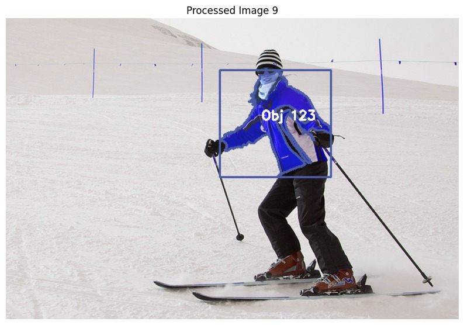

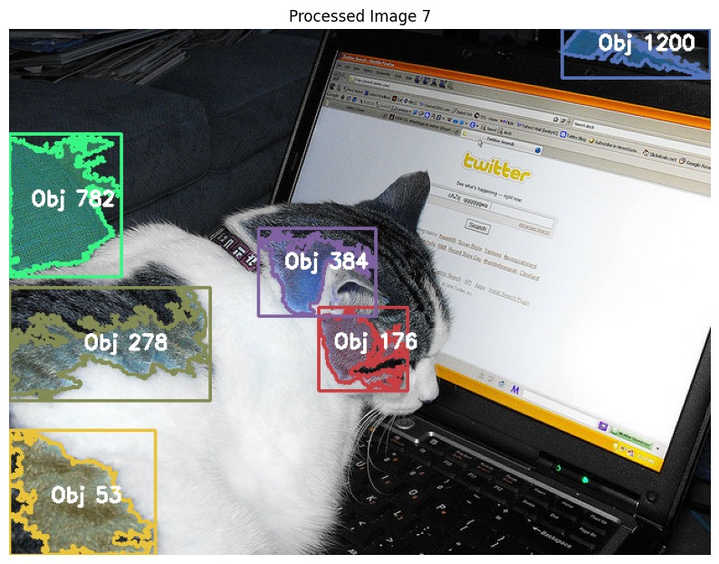
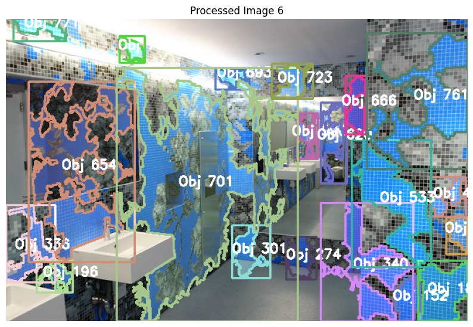
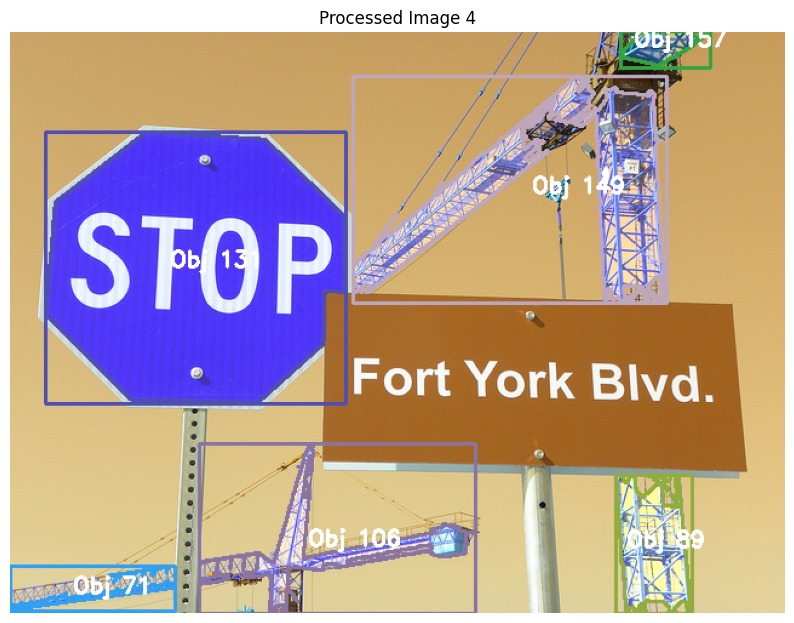
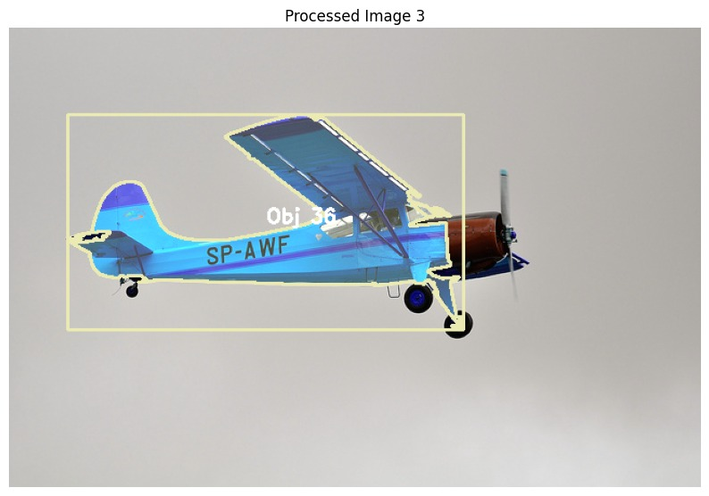

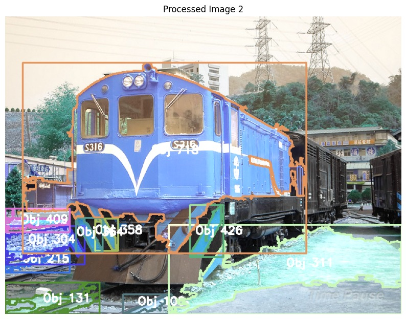
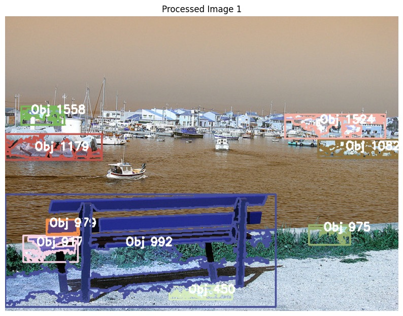
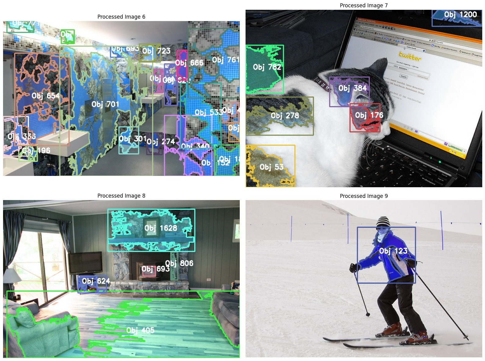
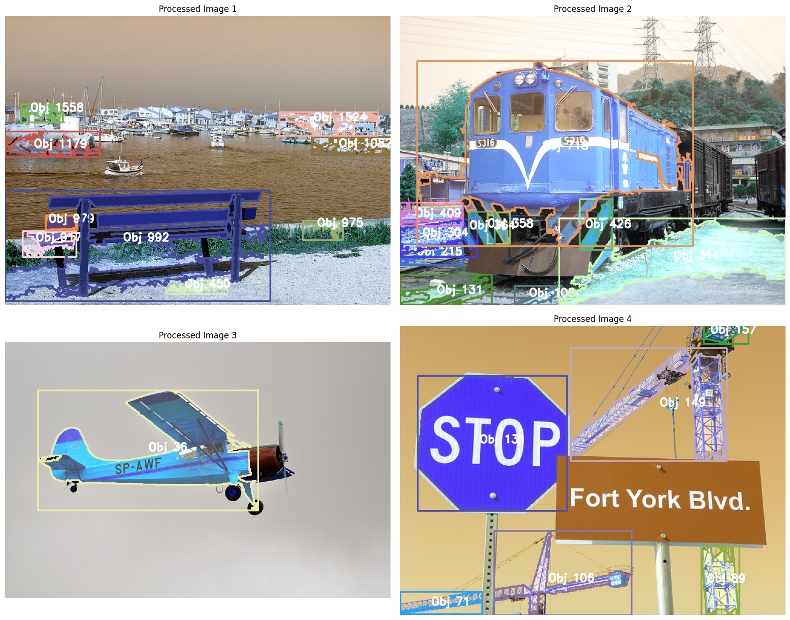
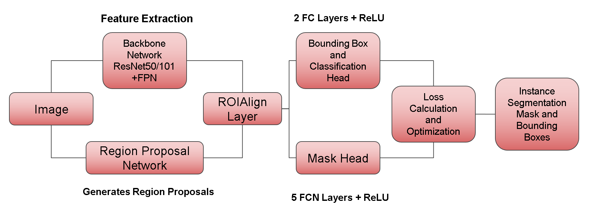
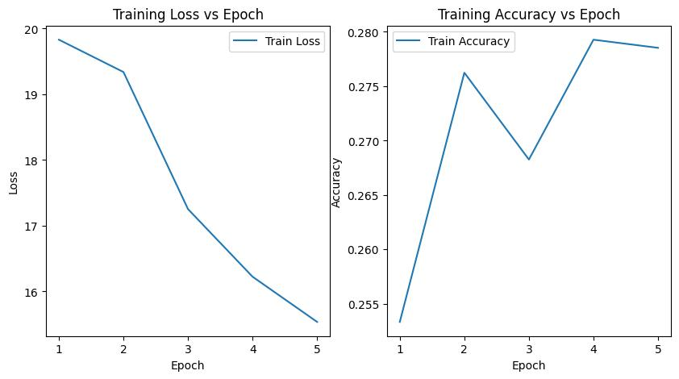
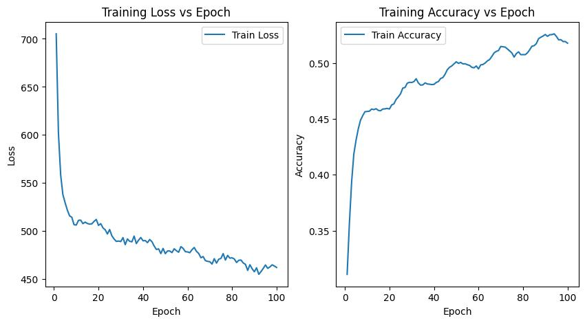


---

## 🔮 Future Improvements
- Optimize inference for real-time applications.  
- Explore lightweight backbones (MobileNet, EfficientNet) for edge devices.  
- Improve handling of occluded and overlapping objects. 
- Extend training to alternate datasets (Cityscapes, PASCAL VOC). 

## ⚡ Usage  
Clone repo:  
```bash
git clone https://github.com/Aishwarya-Joshi11/Object_detection_instance_segmentation_Mask_RCNN.git
cd Object_detection_instance_segmentation_Mask_RCNN

Add all .ipynb files to Google Colab
Change runtime to use an available GPU
Run Colab notebook

## 👤 Author
**Aishwarya Joshi**  
📍 Oregon State University (MS CS) | Software Engineer (AI/ML, Cloud)  
[LinkedIn](https://www.linkedin.com/in/aishwarya-j-822999188) | [GitHub](https://github.com/Aishwarya-Joshi11)

**Keerthana Gopalakrishnan**
**Sanika Prashant Deshmukh**
